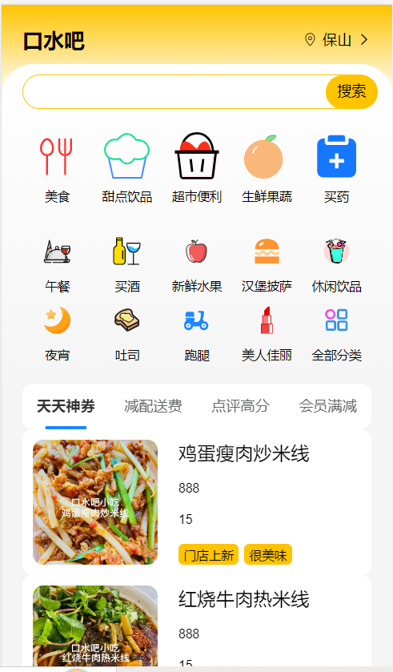

## 友情提示

> **快速体验项目**：[在线访问地址](http://order.toponlineweb.top)：切换为移动端，体验更佳。

> **项目交流**：想要交流项目的朋友，可以加QQ或QQ邮箱与我联系。
> - QQ：3533643117 
> - QQ邮箱：3533643117@qq.com


## 前言

`online-ordering`项目使用了 Vue.js 作为主要的前端框架，并结合了 Vue Router 和 Vuex 实现了单页应用程序的路由和状态管理。同时，该项目还使用了 Vant 组件库、Mock.js 数据生成库、PostCSS-pxtorem 插件等辅助工具，帮助开发者快速构建高质量的移动端应用程序。

## 项目介绍

`online-ordering`是一个网上订餐的前端项目，基于Vue+Vant实现，采用移动端布局。该项目基于手机应用程序，涵盖多个页面，如首页、店铺、购物车、订单、个人中心、地址管理、注册和登录等。在店铺页面，用户可以浏览餐厅信息、菜单、评价等内容，并可以加入购物车或直接购买商品。购物车页面中，用户可以编辑购物车内容，进行全选/全不选/部分选、结算等操作。生成订单页面中，用户可以生成订单并进行支付。地址管理页面中，用户可以编辑或新增地址。个人中心页面中，用户可以查看订单记录、地址管理、账号管理等信息。在账号管理页面中，用户可以保存账号信息或退出登录。另外，用户还可以在注册和登录页面进行账号的注册和登录操作。


## 项目演示

前端项目`manager-system`地址：https://github.com/Fu-Huan-Mei/online-ordering.git

项目在线演示地址： [http://order.toponlineweb.top](http://order.toponlineweb.top)  

项目展示：



## 技术选型

| 技术                | 说明                   | 官网                                                         |
| -----------------  | --------------------- | ------------------------------------------------------------ |
| Vue.js             | 前端框架,版本号为3.2.47| [https://v3.vuejs.org/](https://v3.vuejs.org/)                     |
| Vue Router         | 路由管理器,版本号为4 | [https://router.vuejs.org/](https://router.vuejs.org/)       |
| Vuex               | 全局状态管理库,版本号为4.0.2| [https://vuex.vuejs.org/](https://vuex.vuejs.org/)           |
| Axios              | 基于 Promise 的 HTTP 客户端,版本号为1.4.0| [https://axios-http.com/](https://axios-http.com/) |
| Vant               | 基于 Vue.js 的移动端 UI 组件库,版本号为4.2.0 | [https://vant-contrib.gitee.io/vant/](https://vant-contrib.gitee.io/vant/)  |
| Mock.js            |模拟数据生成库,版本号为1.1.0    | [https://github.com/nuysoft/Mock](https://github.com/nuysoft/Mock) |
| PostCSS-pxtorem    | PostCSS 插件,版本号为5.1.1       | [https://github.com/cuth/postcss-pxtorem](https://github.com/cuth/postcss-pxtorem) |
| amfe-flexible      | 设置 rem 基准值的 JavaScript 库,版本号为2.2.1 | [https://github.com/amfe/lib-flexible](https://github.com/amfe/lib-flexible)|
| Less 和 Less-loader|处理 Less 样式文件 | [https://webpack-v3.jsx.app/loaders/less-loader/](https://webpack-v3.jsx.app/loaders/less-loader/) |
| Webpack            |用于打包和构建 JavaScript 应用程序的现代化静态模块打包器,版本号为4.46.0| [https://webpack.js.org/](https://webpack.js.org/) |


## 插件

| 插件                   | 说明                                                    | 官网                                                        |
| ----------------------| -------------------------------------------------------|------------------------------------------------------------ |
| @vue/cli-plugin-babel |提供了 Babel 编译器的配置和集成，可以将 ES6+ 语法转换为兼容性更好的 JavaScript 代码| [https://cli.vuejs.org/core-plugins/babel.html](https://cli.vuejs.org/core-plugins/babel.html)                     |
| @vue/cli-plugin-eslint|提供了 ESLint 的配置和集成，可以帮助开发者规范代码风格、发现潜在的问题和错误| [https://cli.vuejs.org/core-plugins/eslint.html](https://cli.vuejs.org/core-plugins/eslint.html)               |
|@vue/cli-service|提供了开箱即用的开发服务器、打包构建、测试和部署等功能，可以帮助开发者快速构建和调试应用程序| [https://cli.vuejs.org/guide/cli-service.html](https://cli.vuejs.org/guide/cli-service.html)                     |


## 项目布局

``` lua

public -- 根目录的静态文件
├── favicon.ico -- 网站图标文件
├── index.html -- 整个 Vue.js 应用程序的 HTML 模板
src -- Vue.js应用程序的源代码
├── App.vue -- 应用程序的根组件，定义了应用程序的整体结构和行为
├── main.js -- 应用程序的入口点，负责初始化 Vue 实例并将其挂载到 DOM 上
├── api -- 所有与后端 API 进行通信的代码
├── assets -- 静态资源，例如图像、字体和样式表
├── components -- 通用组件封装
├── router -- vue-router路由配置
├── store -- vuex的状态管理
└── views -- 前端页面
    ├── address -- 地址管理
    ├── addressEdit -- 地址编辑/新增
    ├── createOrder -- 生成订单
    ├── store -- 店铺
    ├── userinfoedit -- 用户信息
    ├── register-- 注册 
    ├── login-- 登录
    ├── home -- 首页
    ├── cart -- 购物车
    ├── order -- 订单
    └── my -- 我的
.env.development -- 开发环境的环境变量
.env.production -- 生产环境的环境变量
.gitignore -- Git控制系统忽略的文件和目录列表
package-lock.json -- 自动生成的，用于确保每个开发人员在安装依赖时使用相同的版本
package.json -- 应用程序所需的所有依赖项和脚本
babel.config.js -- 配置 Babel 的转换规则，以便将 ES6+ 代码转换为 ES5 兼容的代码
vue.config.js -- 配置打包路径、代理设置和插件配置等选项
yarn.lock -- 记录了项目所依赖的各种 JavaScript 包及其版本号，以便在不同环境下安装和使用相同版本的依赖
```


## 感谢

如果对你有帮助送我一颗珍贵的小星星✨✨。


## 注意

如需转载请标明出处，感谢🤞！


